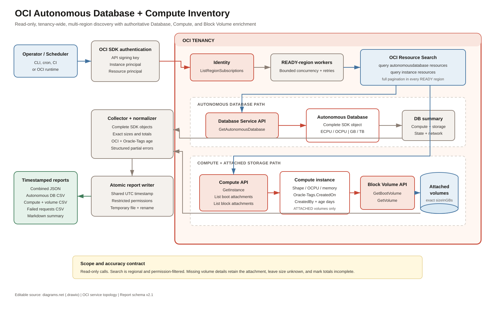
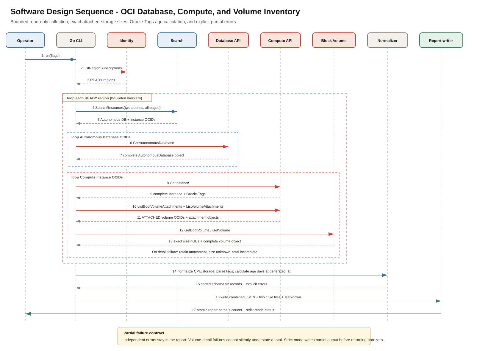

# OCI Autonomous Database and Compute Inventory for Go

`oci-adb-inventory` is a read-only Go utility that inventories Autonomous
Databases, Compute instances, and their currently attached boot and block
volumes in every `READY` OCI region subscribed by a tenancy. It uses OCI
Search for discovery, then authoritative service APIs for complete
configuration and exact storage sizes.

> [!IMPORTANT]
> **Disclaimer:** This is an independent personal project. It is not an Oracle
> product and is not affiliated with, sponsored by, supported by, or endorsed
> by Oracle Corporation. Review the source, IAM policies, generated reports,
> and OCI API behavior before using it in a production tenancy. See
> [DISCLAIMER.md](DISCLAIMER.md).

## What it collects

### Autonomous Databases

- all OCIDs found by `query autonomousdatabase resources`;
- the complete `GetAutonomousDatabase` SDK object;
- ECPU/OCPU model, configured compute, auto-scaling, and legacy CPU fields;
- configured, used, and allocated storage fields;
- workload, version, lifecycle, licensing, endpoints, networking, Data Guard,
  access-control, mTLS, tags, and all other fields returned by the pinned SDK.
- normalized `Oracle-Tags.CreatedOn`, elapsed age in days, and
  `Oracle-Tags.CreatedBy`, exposed explicitly as `created_by_user` and using the
  same audit rules as Compute.
- OCI `timeCreated` plus `nb_created_since`, calculated as complete elapsed
  24-hour periods between that service timestamp and the report timestamp.

### Compute and Block Volume

- all Compute OCIDs found by `query instance resources`;
- the complete `GetInstance` SDK object, including shape configuration;
- shape, OCPUs, VCPUs, memory, availability/fault domain, local disks, and state;
- every boot-volume attachment currently in `ATTACHED` state;
- every data-volume attachment currently in `ATTACHED` state;
- the complete `GetBootVolume` or `GetVolume` object for each attachment;
- exact API `sizeInGBs` and deprecated `sizeInMBs` values without rounding;
- per-instance boot, block, and combined attached-storage totals;
- attachment type, lifecycle, device, read-only/shareable flags, and encryption;
- `Oracle-Tags.CreatedOn`, `Oracle-Tags.CreatedBy`, normalized UTC creation time,
  explicit instance/volume `created_by_user` columns, and whole elapsed age in
  days as of the report timestamp for instances and volumes.

If attachment listing fails, or an attachment is found but its detail lookup
fails, the known attachment is retained where possible, its size is left
unknown, an error is recorded, and the instance's storage total is marked
incomplete. The tool never reports a partial total as complete.

The canonical JSON preserves complete SDK objects. Three CSV files (Autonomous
Database, Compute/storage, and failed requests) and the Markdown report provide
stable normalized views.

## Architecture

The editable diagram uses an OCI-styled service topology and covers Database,
Compute, and Block Volume enrichment.



### SDD sequence

The sequence diagram shows authentication, all-region Search fan-out, database
and compute enrichment, attachment pagination, volume lookups, Oracle tag age
calculation, and atomic report writing.



- [Editable architecture diagram](docs/diagrams/oci-adb-inventory-architecture.drawio)
- [Architecture PNG](docs/diagrams/oci-adb-inventory-architecture.png)
- [Editable SDD sequence diagram](docs/diagrams/oci-adb-inventory-sdd-sequence.drawio)
- [SDD sequence PNG](docs/diagrams/oci-adb-inventory-sdd-sequence.png)
- [Software design description](docs/SDD.md)

## Discovery and enrichment flow

```text
Identity.ListRegionSubscriptions
  -> every READY region
     -> SearchResources("query autonomousdatabase resources")
        -> Database.GetAutonomousDatabase
     -> SearchResources("query instance resources")
        -> Compute.GetInstance
        -> Compute.ListBootVolumeAttachments(instance, AD)
           -> Blockstorage.GetBootVolume
        -> Compute.ListVolumeAttachments(instance)
           -> Blockstorage.GetVolume
     -> normalize sizes + Oracle-Tags audit fields
        -> timestamped JSON + 3 CSV files + Markdown
```

OCI Search is region-scoped, so both paginated queries run in every selected
region. Results are de-duplicated by `(region, OCID)`. The service-specific
`Get` and attachment APIs are the source of truth for the report.

## Prerequisites

- Go 1.25 or newer;
- GNU Make;
- OCI API signing-key configuration, an OCI Compute instance principal, an OCI
  resource-principal runtime, or an enhanced OKE cluster with workload identity;
- the IAM permissions below;
- network access to Identity, Resource Search, Database, Compute, and Block
  Volume endpoints in all selected regions.

The project pins `github.com/oracle/oci-go-sdk/v65` at `v65.117.1`.

## IAM policy examples

For an identity-domain group:

```text
Allow group <identity-domain>/<group-name> to inspect tenancies in tenancy
Allow group <identity-domain>/<group-name> to inspect autonomous-databases in tenancy
Allow group <identity-domain>/<group-name> to read instance-family in tenancy
Allow group <identity-domain>/<group-name> to inspect volume-family in tenancy
```

For an instance principal:

```text
Allow dynamic-group <dynamic-group-name> to inspect tenancies in tenancy
Allow dynamic-group <dynamic-group-name> to inspect autonomous-databases in tenancy
Allow dynamic-group <dynamic-group-name> to read instance-family in tenancy
Allow dynamic-group <dynamic-group-name> to inspect volume-family in tenancy
```

`read instance-family` is required because `GetInstance` needs
`INSTANCE_READ`. `inspect volume-family` provides the inspect permissions used
by the volume and attachment read operations. OCI Search uses the caller's
existing permissions and needs no separate Search policy. See
[policies/README.md](policies/README.md) for least-privilege notes.

## Build and test

### Recommended Linux build script

Install GNU Make if it is not already present:

```bash
# Oracle Linux, RHEL, Rocky Linux, or AlmaLinux
sudo dnf install -y git make

# Ubuntu or Debian
sudo apt-get update
sudo apt-get install -y git make
```

Install Go 1.25 or newer using the official
[Go installation instructions](https://go.dev/doc/install), then verify both
tools:

```bash
go version
make --version
```

The root [build.sh](build.sh) is the safest complete rebuild path. From the
repository root, run it as a normal Linux user:

```bash
chmod +x build.sh
./build.sh
```

The script resolves its own project directory, so it can also be invoked by
absolute path while your shell is in another directory.

It performs these operations in order:

1. resolves the project and exact target path;
2. verifies that `go` and GNU Make are available;
3. runs `make clean`, which removes only `bin/oci-adb-inventory`;
4. confirms that no previous binary remains;
5. downloads the modules pinned by `go.mod` and `go.sum`;
6. runs all tests and `go vet`;
7. builds a new CGO-disabled, trimmed Linux executable;
8. verifies the new file is executable and prints its application version and
   SHA-256 checksum.

If dependency download, tests, vet, or compilation fails, the script exits
non-zero and does not leave the old executable where it could be mistaken for a
successful new build. To skip tests and vet for a controlled build only:

```bash
RUN_TESTS=0 ./build.sh
```

The default is `RUN_TESTS=1`; normal release builds should retain it.

### How to use the Makefile

The Makefile is a set of named build commands called **targets**. Run them from
the repository root. `make` without a target selects `all`, which builds the
binary but does not download modules or run tests explicitly:

```bash
make help
make
```

Available targets:

| Command | Action |
|---|---|
| `make deps` | Download modules from `go.mod`/`go.sum` |
| `make test` | Run `go test ./...` |
| `make vet` | Run `go vet ./...` |
| `make check` | Run both tests and vet |
| `make fmt` | Format Go source under `cmd/` and `internal/` |
| `make build` | Build `bin/oci-adb-inventory`; an existing file is replaced only when the build writes the new output |
| `make clean` | Remove only `bin/oci-adb-inventory`; it does not delete reports, source, or Go caches |
| `make rebuild` | Run `clean` followed by `build`; it does not run tests |

A complete manual release sequence equivalent to the main parts of `build.sh`
is:

```bash
make clean
make deps
make check
make build
./bin/oci-adb-inventory --version
sha256sum ./bin/oci-adb-inventory
```

The Makefile defaults to `CGO_ENABLED=0` and linker flags `-s -w`. Override them
only when there is a reviewed requirement:

```bash
make rebuild CGO_ENABLED=1
make rebuild LDFLAGS=
```

The earlier Makefile used `go clean`, which cleans Go build artifacts but does
not guarantee removal of the explicit `go build -o bin/oci-adb-inventory`
output. The updated `clean` target names that one file directly.

### Direct Go commands and Windows

Without GNU Make, the equivalent Linux commands are:

```bash
mkdir -p bin
rm -f -- bin/oci-adb-inventory
go mod download
go test ./...
go vet ./...
CGO_ENABLED=0 go build -trimpath -ldflags="-s -w" \
  -o bin/oci-adb-inventory ./cmd/oci-adb-inventory
```

On Windows PowerShell:

```powershell
New-Item -ItemType Directory -Force -Path .\bin | Out-Null
go build -trimpath -o bin/oci-adb-inventory.exe ./cmd/oci-adb-inventory
```

## Run with API keys

The default mode reads the `DEFAULT` profile from `~/.oci/config` or the file
named by `OCI_CONFIG_FILE`:

```bash
./bin/oci-adb-inventory \
  --auth api_key \
  --profile DEFAULT \
  --output-dir reports
```

Use a different configuration and profile:

```bash
./bin/oci-adb-inventory \
  --auth api_key \
  --config-file /secure/path/oci-config \
  --profile REPORTING \
  --output-dir reports
```

The private key is only used by the SDK signer and is never copied into a
report.

## Run with an instance principal

```bash
./bin/oci-adb-inventory \
  --auth instance_principal \
  --output-dir reports
```

## Run with a resource principal

```bash
./bin/oci-adb-inventory \
  --auth resource_principal \
  --output-dir reports
```

The hosting service's resource-principal policy condition must be scoped to
that service. Do not use an unconditioned `any-user` policy.

## Run with OKE workload identity

Use this only from a pod in an **enhanced** OKE cluster. The pod must use the
namespace and service account named in its OCI workload-identity policy. OKE
mounts the service-account token and Kubernetes CA certificate; the manifest
sets the two OCI SDK environment variables:

```yaml
spec:
  serviceAccountName: oci-adb-inventory
  containers:
    - name: inventory
      env:
        - name: OCI_RESOURCE_PRINCIPAL_VERSION
          value: "2.2"
        - name: OCI_RESOURCE_PRINCIPAL_REGION
          value: eu-frankfurt-1
      args:
        - --auth
        - oke_workload_identity
        - --output-dir
        - /reports
```

Do not mount API keys in this mode. The companion OKE/Terraform project creates
the enhanced cluster, scoped policy, service account, `CronJob`, and persistent
report volume.

## Region selection

All `READY` subscribed regions are scanned by default. To scan a subset:

```bash
./bin/oci-adb-inventory \
  --regions eu-paris-1,eu-frankfurt-1 \
  --output-dir reports
```

The tool rejects regions that are not subscribed or not `READY`.
`--bootstrap-region` controls the initial Identity endpoint when needed.

## Reports

A run at `2026-07-29T10:11:12Z` writes:

```text
reports/
  oci-tenancy-inventory-20260729T101112Z.json
  oci-tenancy-inventory-20260729T101112Z-autonomous-databases.csv
  oci-tenancy-inventory-20260729T101112Z-compute-instances.csv
  oci-tenancy-inventory-20260729T101112Z-failed-requests.csv
  oci-tenancy-inventory-20260729T101112Z.md
```

### JSON

The JSON report has schema version `2.2`. Each Compute record contains the
complete instance object and nested boot/data volume objects:

```json
{
  "summary": {
    "display_name": "app-01",
    "shape": "VM.Standard.E5.Flex",
    "oracle_tags": {
      "created_on_raw": "2026-07-01T08:30:00Z",
      "created_on_utc": "2026-07-01T08:30:00Z",
      "created_by": "alice@example.com",
      "created_by_user": "alice@example.com",
      "age_days_as_of_report": 28,
      "created_on_tag_status": "parsed"
    },
    "boot_volume_total_size_in_gbs": 100,
    "attached_block_volume_total_size_in_gbs": 500,
    "attached_storage_total_size_in_gbs": 600,
    "attached_storage_size_complete": true
  },
  "configuration": {
    "id": "ocid1.instance.oc1...",
    "shape": "VM.Standard.E5.Flex"
  },
  "boot_volumes": [],
  "attached_block_volumes": []
}
```

`configuration` and the nested volume records contain complete SDK objects,
not the abbreviated example above.

### Oracle-Tags creation semantics

Creation attribution for Autonomous Databases, Compute instances, boot
volumes, and block volumes is taken only from the defined-tag namespace
`Oracle-Tags`:

- `CreatedOn` is retained verbatim in `created_on_raw`;
- valid RFC3339 values are normalized to UTC in `created_on_utc`;
- `age_days_as_of_report` is the number of complete elapsed 24-hour periods
  between the tag timestamp and the report's `generated_at`;
- `CreatedBy` is retained verbatim as `created_by`; the explicit
  `created_by_user` alias contains the same value and is intended for direct
  inventory filtering and reporting;
- `created_on_tag_status` is `parsed`, `missing`, `invalid`, or `unavailable`
  when a volume detail lookup failed.

The CSV reports retain their earlier `oracle_created_by`,
`instance_oracle_created_by`, and `volume_oracle_created_by` columns for
compatibility. They also expose the clearer `created_by_user`,
`instance_created_by_user`, and `volume_created_by_user` columns. The Markdown
tables label this value **CreatedBy user**. All values come exclusively from
`Oracle-Tags.CreatedBy`; the tool does not infer an identity from unrelated
tags or API metadata.

OCI's separate API `timeCreated` field is retained as `oci_time_created` but is
not substituted for a missing `Oracle-Tags.CreatedOn`. This makes the requested
tag provenance auditable. Tenancies without the automatic tag defaults, older
resources, or resources whose tags were removed can legitimately report
`missing`.

For Autonomous Databases, `time_created` is the value returned by
`GetAutonomousDatabase`, while `nb_created_since` is the number of complete
elapsed 24-hour periods from `time_created` to the run's fixed `generated_at`.
It is intentionally independent of `age_days_as_of_report`, which continues to
measure the `Oracle-Tags.CreatedOn` value. A blank `nb_created_since` means the
Database API did not return `timeCreated`.

### Storage semantics

Compute storage values use the exact integer `sizeInGBs` returned by
`GetBootVolume` and `GetVolume`. The tool does not estimate guest filesystem
usage or partition sizes. Only attachments whose lifecycle state is
`ATTACHED` are counted.

Instance totals include:

| Field | Meaning |
|---|---|
| `boot_volume_total_size_in_gbs` | Sum of attached boot-volume API sizes |
| `attached_block_volume_total_size_in_gbs` | Sum of attached data-volume API sizes |
| `attached_storage_total_size_in_gbs` | Boot plus attached data volumes |
| `boot_volume_inventory_complete` | Boot-attachment listing completed |
| `block_volume_inventory_complete` | Block-attachment listing completed |
| `attached_storage_size_complete` | `true` only when both attachment listings complete and every discovered attachment has a known API size |

Local NVMe/storage supplied by a Compute shape is retained separately in shape
configuration and is not added to Block Volume totals.

Autonomous Database storage retains OCI's GB and TB fields exactly. Its
normalized aggregation uses the GB value when present, otherwise `TB * 1024`.

### CSV files

The Autonomous Database CSV contains one row per database, including
`time_created` and `nb_created_since`. The Compute CSV contains one row per
attached boot or data volume, repeating the parent instance fields so it can be
filtered or pivoted directly. An instance with no retrievable attachments still
receives an instance-only row.

The failed-request CSV always has a header and contains one row per collection
error. For OCI service errors it preserves the HTTP status, service code,
retryability, operation, endpoint, client version, request timestamp, OPC
request ID, documentation links, a plain-language diagnosis, and suggested
actions. Resource `Get` failures also retain the compartment, display name,
lifecycle state, and creation time originally returned by Search, making a
stale index result easier to identify. Treat this file as sensitive tenancy
metadata.

### Markdown

The Markdown report provides regional totals, Autonomous Database details and
OCI creation age, Compute instance/tag-age/storage totals, individual
attached-volume sizes, and a concise error table linked to the full
failed-request CSV.

## Understanding `404 NotAuthorizedOrNotFound`

For `GetAutonomousDatabase`, OCI uses the same 404 response when either the
OCID no longer resolves or the caller is not allowed to inspect it. The
response does not tell the client which case occurred. Oracle classifies this
error as non-retryable; the SDK's normal retry policy therefore does not solve
it by repeating the unchanged call.

The reported Frankfurt requests used an `eu-frankfurt-1` Autonomous Database
OCID and the matching endpoint
`database.eu-frankfurt-1.oraclecloud.com`. That rules out an obvious regional
endpoint mismatch. It also confirms that request signing reached the Database
Service: invalid or absent authentication normally produces `401
NotAuthenticated`, not this resource-level 404.

Both Search visibility for `autonomous-databases` and
`GetAutonomousDatabase` require `AUTONOMOUS_DATABASE_INSPECT`. Therefore:

- if only a few Search results fail while other databases are retrieved, first
  investigate deleted/terminated or recently moved resources, stale
  index-backed Search metadata, and compartment/tag-conditional IAM;
- if every Autonomous Database `Get` fails, first investigate the active
  profile or principal, identity-domain/dynamic-group membership, tenancy
  override, and tenancy-wide versus compartment-scoped policies;
- if Search and `Get` were run under different credentials, a Search hit does
  not prove that the identity used for `Get` has access.

Use the same authentication mode and profile as the utility for a direct test:

```bash
ADB_OCID='ocid1.autonomousdatabase.oc1.eu-frankfurt-1.example'
oci db autonomous-database get \
  --autonomous-database-id "$ADB_OCID" \
  --region eu-frankfurt-1 \
  --profile DEFAULT
```

Then work through this checklist:

1. Confirm the OCID exists in the expected tenancy and region and was not
   terminated or moved after Search indexed it.
2. Confirm the caller is the intended API-key user, instance principal, or
   resource principal. If `--tenancy-id` is present, ensure it identifies the
   same tenancy as the signer.
3. Confirm an effective policy grants `inspect autonomous-databases` in the
   resource's current compartment or in the tenancy. Check identity-domain
   group names, dynamic-group rules, and all tag or request conditions.
4. Inspect the generated failed-request CSV. Compare
   `search_compartment_ocid`, `search_lifecycle_state`, and
   `search_time_created` with the live resource and retain `opc_request_id`.
5. Rerun after OCI Search has converged. If the direct `Get` still fails and
   the resource and policy are verified, open an Oracle Support request with
   the complete failed-request row and OPC request ID.

For maximum SDK diagnostics during a controlled troubleshooting run:

```bash
OCI_GO_SDK_DEBUG=info ./bin/oci-adb-inventory \
  --auth api_key \
  --profile DEFAULT \
  --regions eu-frankfurt-1 \
  --output-dir reports
```

Debug output can contain request metadata. Redirect it to a protected location
and do not publish it without review.

## Failure behavior

Authentication and region-subscription failures stop the run. Regional Search,
individual resource, attachment-list, and volume-detail errors are recorded
while independent regions and resources continue. Every run creates the
timestamped failed-request CSV, even when it contains only the header.

Strict mode writes the partial report and then returns non-zero if any
collection error occurred:

```bash
./bin/oci-adb-inventory --strict --output-dir reports
```

The timeout and bounded worker pool apply to the entire collection:

```bash
./bin/oci-adb-inventory --timeout 45m --workers 12
```

## Options

```text
--auth string               api_key, instance_principal, resource_principal,
                            or oke_workload_identity
--bootstrap-region string   region for the initial Identity request
--config-file string        OCI SDK config path
--output-dir string         report directory (default "reports")
--profile string            OCI config profile (default "DEFAULT")
--regions string            comma-separated READY region subset
--strict                    fail after writing a partial report on errors
--tenancy-id string         optional explicit tenancy OCID
--timeout duration          overall timeout (default 30m)
--version                   print version
--workers int               concurrent OCI operations
```

## Podman on Linux: build, deploy, and run

Podman is the primary container workflow for this project. It builds standard
OCI images, runs rootless without a daemon, and accepts the same image format
that OKE and Docker use. Docker is not required.

### Why `Containerfile` and `Dockerfile` are included

The native Go binary remains the simplest choice when installing it directly is
acceptable. A container makes the Linux build reproducible and avoids installing
Go on the execution server. `Containerfile` is the canonical Podman build file;
the identical `Dockerfile` is retained for Docker-compatible build systems.

Both use two stages:

1. `golang:1.25` downloads pinned modules and builds a static, CGO-disabled
   executable.
2. `gcr.io/distroless/static-debian12:nonroot` runs only that executable as a
   non-root user. It contains no shell, package manager, Go compiler, or OCI
   credentials.

This is a one-shot batch program. It opens no listening port, needs no `EXPOSE`,
and exits after writing five reports. `.dockerignore` prevents local reports,
caches, OCI configuration, key formats, and environment files from entering the
build context.

### Step 1: install Podman

Oracle Linux 8/9, RHEL, Rocky Linux, or AlmaLinux:

```bash
sudo dnf install -y podman git
podman --version
podman info
```

Ubuntu or Debian:

```bash
sudo apt-get update
sudo apt-get install -y podman git
podman --version
podman info
```

Run the remaining commands as a normal Linux user. Rootless Podman is preferred;
do not add `sudo` unless your platform standard explicitly requires rootful
containers.

### Step 2: obtain and build the project

```bash
git clone https://github.com/eugsim1/oci-autonomous-database-inventory-go.git
cd oci-autonomous-database-inventory-go
podman build --pull=always \
  --file Containerfile \
  --tag localhost/oci-adb-inventory:2.3.0 \
  .
podman image inspect localhost/oci-adb-inventory:2.3.0
podman run --rm localhost/oci-adb-inventory:2.3.0 --version
```

The build host needs HTTPS access to the Go module proxy and both base-image
registries. Rebuild periodically to incorporate patched base images. For
reproducible promotion, deploy by immutable image digest rather than a mutable
tag.

### Step 3A: configure API-key authentication

Create the OCI SDK config outside this repository. Keep the key in the same
directory so the complete directory can be mounted at the same absolute Linux
path:

```bash
mkdir -p "$HOME/.oci"
chmod 700 "$HOME/.oci"
chmod 600 "$HOME/.oci/config" "$HOME/.oci/oci_api_key.pem"
```

Example `$HOME/.oci/config`:

```ini
[DEFAULT]
user=ocid1.user.oc1..example
fingerprint=aa:bb:cc:dd:example
tenancy=ocid1.tenancy.oc1..example
region=eu-frankfurt-1
key_file=/home/your-user/.oci/oci_api_key.pem
```

`key_file` must be an absolute path that exists inside the container. The next
command mounts `$HOME/.oci` at that same absolute path, so replace
`/home/your-user` with the real output of `printf '%s\n' "$HOME"`. Never copy
the key into this project or an image layer.

### Step 4A: run with an API key

The supplied wrapper adds a read-only root filesystem, drops Linux capabilities,
prevents privilege escalation, preserves the calling UID/GID, uses private
SELinux relabeling (`:Z`), and writes only to the mounted reports directory:

```bash
chmod +x scripts/*.sh
./scripts/run-podman-api-key.sh --strict --timeout 45m
```

Optional variables and arguments:

```bash
OCI_PROFILE=REPORTING \
OUTPUT_DIR=/srv/oci-inventory/reports \
APP_IMAGE=localhost/oci-adb-inventory:2.3.0 \
./scripts/run-podman-api-key.sh \
  --regions eu-frankfurt-1,eu-amsterdam-1 \
  --workers 8
```

The equivalent explicit command is:

```bash
mkdir -p "$PWD/reports"
podman run --rm \
  --userns=keep-id \
  --user "$(id -u):$(id -g)" \
  --read-only \
  --security-opt=no-new-privileges \
  --cap-drop=ALL \
  --env "HOME=$HOME" \
  --volume "$HOME/.oci:$HOME/.oci:ro,Z" \
  --volume "$PWD/reports:/reports:Z" \
  localhost/oci-adb-inventory:2.3.0 \
  --auth api_key \
  --config-file "$HOME/.oci/config" \
  --profile DEFAULT \
  --output-dir /reports
```

Use `:z` instead of `:Z` only when multiple containers intentionally share the
same bind mount. On systems without SELinux, Podman accepts the option without
requiring a policy change.

### Step 3B/4B: use an OCI Compute instance principal

On an OCI Compute instance, place that instance in the intended dynamic group
and grant the four read policies in [policies/README.md](policies/README.md).
No API key is mounted:

```bash
chmod +x scripts/*.sh
./scripts/run-podman-instance-principal.sh --strict --timeout 45m
```

The wrapper uses `--network host` so the SDK can reach the OCI instance metadata
service. Run it only on the intended OCI instance, and retain the host firewall
and container-network controls required by your organization.

### Step 5: verify and retain the reports

```bash
find reports -maxdepth 1 -type f -printf '%TY-%Tm-%TdT%TH:%TM:%TS %f\n' | sort
latest_markdown="$(find reports -maxdepth 1 -name '*.md' -type f -printf '%T@ %p\n' | sort -nr | head -n1 | cut -d' ' -f2-)"
sed -n '1,80p' "$latest_markdown"
```

The container is automatically removed by `--rm`; timestamped reports remain on
the host. Treat JSON, CSV, Markdown, and logs as sensitive tenancy metadata.

### Step 6: optionally push the image to OCIR

First create an OCI auth token for the registry user. Do not use the OCI console
password. The current recommended registry domain format is
`ocir.<region>.oci.oraclecloud.com`:

```bash
export OCI_REGION=eu-frankfurt-1
export OCI_NAMESPACE='<tenancy-namespace>'
export OCIR_REPOSITORY='oci-adb-inventory'
export IMAGE_TAG='2.3.0'
export IMAGE="ocir.${OCI_REGION}.oci.oraclecloud.com/${OCI_NAMESPACE}/${OCIR_REPOSITORY}:${IMAGE_TAG}"
read -rsp 'OCIR auth token: ' OCIR_AUTH_TOKEN; echo
printf '%s' "$OCIR_AUTH_TOKEN" | podman login \
  --username "${OCI_NAMESPACE}/<identity-domain>/<username>" \
  --password-stdin \
  "ocir.${OCI_REGION}.oci.oraclecloud.com"
unset OCIR_AUTH_TOKEN
podman tag localhost/oci-adb-inventory:2.3.0 "$IMAGE"
podman push "$IMAGE"
podman logout "ocir.${OCI_REGION}.oci.oraclecloud.com"
```

For a legacy tenancy without identity domains, the username can be
`<tenancy-namespace>/<username>`. Create the private OCIR repository first or
allow the push identity to create it. The companion OKE Terraform project
creates the repository but intentionally never stores the auth token in
Terraform state.

### Step 7: schedule the one-shot run

Because the program exits, schedule the wrapper rather than keeping a container
running. For example, edit the current user's crontab with `crontab -e` and run
at 02:15 UTC daily:

```cron
15 2 * * * cd /opt/oci-autonomous-database-inventory-go && OUTPUT_DIR=/srv/oci-inventory/reports ./scripts/run-podman-instance-principal.sh --strict --timeout 45m >>/srv/oci-inventory/podman-run.log 2>&1
```

Use an absolute checkout path, pre-create the output/log directory with owner-only
permissions, and confirm the scheduler's time zone. For API keys, the scheduled
user must own and be able to read the protected `$HOME/.oci` files.

### Resource principals and Docker compatibility

For a non-OKE OCI resource-principal runtime, pass only the service-injected
environment variables and bind-mounted token/key paths. Never bake them into an
image. OKE uses the dedicated `oke_workload_identity` mode described earlier.

The same image can be built with Docker when a downstream system requires it:

```bash
docker build --pull --file Dockerfile --tag oci-adb-inventory:2.3.0 .
```

Podman and Docker are alternative local runtimes; Kubernetes/OKE later pulls the
same OCI image and schedules it as a `Job` or `CronJob`.

## Security notes

- All OCI operations are reads.
- Reports use restricted file permissions where supported and are written
  through a temporary file followed by an atomic rename.
- `reports/` is excluded from Git.
- Full JSON can contain instance metadata, OCIDs, IP/network data, tags,
  endpoints, ACLs, and customer-contact metadata. Store it as sensitive data.
- OCI Search is index-backed and can be eventually consistent immediately
  after a resource change.

## Project layout

```text
cmd/oci-adb-inventory/   CLI entry point
build.sh                 validated clean/test/vet/static-build workflow for Linux
Makefile                 composable dependency, QA, build, rebuild, and clean targets
internal/config/         flags and validation
internal/model/          canonical report model, tag audit, normalization
internal/oci/            auth, Search, Database, Compute, Block Volume clients
internal/report/         JSON, three CSV files, Markdown, atomic writes
docs/                    SDD and editable diagrams
policies/                IAM and resource-principal guidance
scripts/                 hardened Podman run wrappers for Linux
Containerfile            canonical Podman/OCI image build
Dockerfile               Docker-compatible copy of the image build
```

## Oracle documentation

- [Search query language](https://docs.oracle.com/en-us/iaas/Content/Search/Concepts/querysyntax.htm)
- [Querying resources](https://docs.oracle.com/en-us/iaas/Content/Search/Tasks/queryingresources.htm)
- [OCI API errors](https://docs.oracle.com/en-us/iaas/Content/API/References/apierrors.htm)
- [Database Service IAM reference](https://docs.oracle.com/en-us/iaas/Content/Identity/Reference/databasepolicyreference.htm)
- [Search IAM permissions](https://docs.oracle.com/en-us/iaas/Content/Identity/policyreference/searchpolicyreference.htm)
- [Automatic Oracle-Tags defaults](https://docs.oracle.com/en-us/iaas/Content/Tagging/Concepts/understandingautomaticdefaulttags.htm)
- [Core Services IAM policy reference](https://docs.oracle.com/en-us/iaas/Content/Identity/Reference/corepolicyreference.htm)
- [Getting boot-volume details](https://docs.oracle.com/en-us/iaas/Content/Block/Tasks/get-bv-boot-volume.htm)
- [Getting block-volume details](https://docs.oracle.com/en-us/iaas/Content/Block/Tasks/get-bv-volume.htm)
- [OCI Go SDK authentication](https://docs.oracle.com/en-us/iaas/Content/API/SDKDocs/gosdkgettingstarted.htm)
- [OKE workload identity](https://docs.oracle.com/en-us/iaas/Content/ContEng/Tasks/contenggrantingworkloadaccesstoresources.htm)
- [OCIR concepts and image names](https://docs.oracle.com/en-us/iaas/Content/Registry/Concepts/registryconcepts.htm)

## License

MIT. See [LICENSE](LICENSE).
